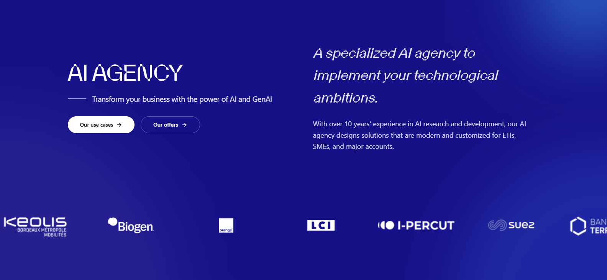

# 🚀 BeTomorrow AI Agency – Clone



A modern **AI Agency website clone** built for **UXGENIE**, designed to demonstrate how intelligent design and advanced frontend technologies can transform digital storytelling.

This project blends **AI-inspired aesthetics**, **motion-rich interfaces**, and **high-performance architecture** — delivering a futuristic user experience powered by **Next.js 15, React 19, Tailwind CSS 4, and Framer Motion**.

---

## 🌐 Live Demo

👉 [https://ai-agency-mauve.vercel.app/](https://ai-agency-mauve.vercel.app/)

---

## 🧠 Overview

**BeTomorrow AI Agency – Clone** is a creative, minimal, and interactive website designed to showcase the potential of AI-driven agencies.  
Every animation, gradient, and transition is crafted to enhance engagement and bring the interface to life.

Developed as **PROJECT 2** under **UXGENIE**, this build highlights the perfect balance between **design, motion, and performance**.

---

## 🧰 Tech Stack

| Technology         | Purpose                                 |
| ------------------ | --------------------------------------- |
| **Next.js 15**     | App router, SSR, and SSG rendering      |
| **React 19**       | Component-based UI library              |
| **Tailwind CSS 4** | Utility-first CSS framework             |
| **Framer Motion**  | Animation and transitions               |
| **Radix UI**       | Accessible and composable UI primitives |
| **TypeScript**     | Static typing for better reliability    |

---

## ✨ Key Features

- ⚡ **Next.js 15 with Turbopack** for ultra-fast builds and performance
- 🎬 **Framer Motion** animations for smooth and elegant transitions
- 🎨 **Tailwind CSS 4 + Noise Textures** for a clean, modern, AI-inspired UI
- 📱 **Fully responsive** and mobile-friendly layout
- 🔍 **SEO optimized** and ready for production
- 🧩 **Radix UI components** for accessibility and consistency

---

## 🛠️ Installation

Clone the repo and install dependencies:

```bash
# 1️⃣ Clone the repository
git clone https://github.com/abdud099/Ai-Agency.git

# 2️⃣ Navigate to the project folder
cd betomorrow-ai-agency

# 3️⃣ Install dependencies
npm install

# 4️⃣ Run the development server
npm run dev
```

Your app will be available at: **http://localhost:3000**

---

## 🛠 Available Scripts

```bash
npm run dev       # Start the development server
npm run build     # Build for production
npm run start     # Start the production server
npm run lint      # Run ESLint for code quality
```

---

## 🔍 Linting & Formatting

This project uses **ESLint (Next.js config)** to maintain a clean and consistent code style.

```bash
npm run lint
```

---

## 🌐 Deployment

You can easily deploy with platforms like **Vercel**, **Netlify**, or **Render**.

To build for production:

```bash
npm run build
```

Then deploy the generated `.next/` folder automatically (Vercel) or your preferred hosting provider.

---

## 📂 Project Structure

```
src/
│
├── app/
│   ├── layout.tsx          # Root layout
│   ├── page.tsx            # Homepage
│
├── components/
│   ├── Hero.tsx            # Hero section with animations
│   ├── Services.tsx        # Services section
│   ├── Testimonial.tsx     # Testimonials and Resources
│   ├── Footer.tsx          # Footer section
│
├── styles/
│   ├── globals.css         # Global styles and background setup
│
└── public/
    ├── assets/             # Images and media files
```

---

## 📬 Contact

If you’d like to **collaborate, discuss UI/UX ideas, or hire me** for frontend projects:

- 🌐 **Portfolio:** [my-portfolio-link.com](https://my-portfolio-2ac5ob1mu-basitmaliks-projects-774a8708.vercel.app/)
- 💼 **LinkedIn:** [linkedin.com/in/abdulbasit-codes/](https://www.linkedin.com/in/abdulbasit-codes/)
- 🐙 **GitHub:** [github.com/abdud099](https://github.com/abdud099)
- 📧 **Email:** [abdud099@gmail.com](mailto:abdud099@gmail.com)

---

## 🏢 Client / Organization

**UXGENIE** – A leading digital innovation company empowering developers and designers to build next-gen web experiences.

---

## 📝 License

This project is licensed under the **MIT License** — feel free to use and modify with attribution.

---

> **Developed by [Abdul Basit](https://www.linkedin.com/in/abdulbasit-codes/)**  
> Chief Data Scientist & Frontend Developer @ CencerClarity LLC  
> Crafted with ❤️ using Next.js, Tailwind CSS & Framer Motion
